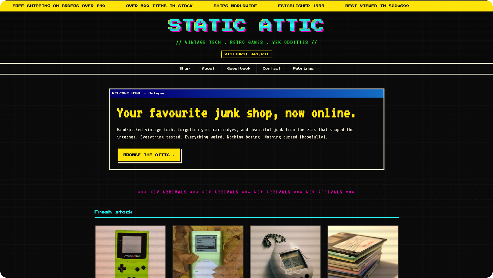

# STATIC ATTIC - Vintage Tech & Retro Collectibles

✨ [LIVE DEMO](https://reb84.github.io/retro-store-landing/)

STATIC ATTIC is a single-page landing site for a fictional shop selling vintage game hardware, Y2K oddities, and forgotten tech. The design leans hard into late 90s / early 2000s web aesthetics: pixel fonts, marquee banners, scanline overlays, Windows 95-style title bars, and a visitor counter, all while keeping the underlying HTML semantic and accessible.

All the chaos of the early internet, but with modern accessibility and SEO underneath.

---

## Tech stack

Vanilla HTML and CSS only - no JavaScript, no frameworks, no dependencies beyond Google Fonts.

| Layer | Choice |
|---|---|
| Markup | HTML5 |
| Styles | CSS3 (custom properties, Grid, pseudo-elements, keyframe animations) |
| Fonts | Google Fonts (Press Start 2P, VT323, Share Tech Mono) |
| Hosting | GitHub Pages |

Images from Unsplash.

---

*This is a fictional project built for portfolio purposes. Static Attic does not exist (unfortunately).*